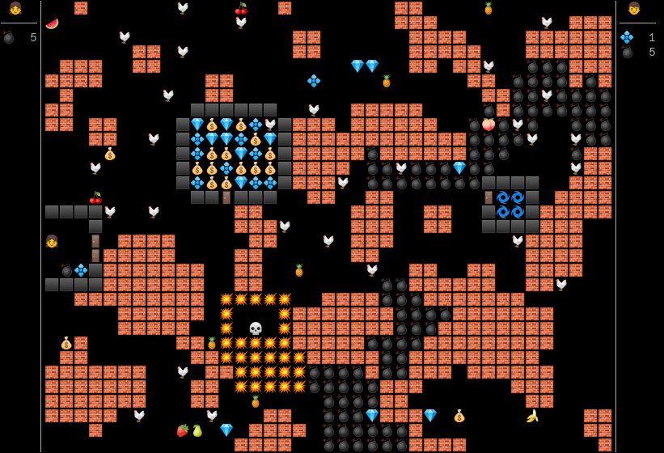

# Gamoji - an emoji-based terminal game in Julia

A silly little emoji game for my children 😃



## Installation

You need a color terminal with a good emoji font.  I assume the terminal
supports [ANSI escape codes](https://en.wikipedia.org/wiki/ANSI_escape_code)
for color and various cursor control.

On Ubuntu 18.04 I've tested it with

* Terminal: `gnome-terminal --disable-factory`
* Emoji font: `fonts-noto-color-emoji`

```
julia --project=. -e 'using Pkg; Pkg.instantiate()'
```

## Running the game

Run with:

```
./gameoji.jl
```

or

```
julia --project=. gameoji.jl
```

or in development, just `include("gameoji.jl")`.

Then you walk around collecting items, there's not really an aim to the game!
Bombs can be used to explode walls to get access to new areas. Very different
levels are randomly generated each time.

## Controls

The girl and boy emoji both have controls on the same keyboard — WASD and arrow
keys respectively to move, and `1` and `0` to drop a bomb.

## Live-coding of game rules!

Gameoji starts a REPL server using
[RemoteREPL.jl](https://github.com/c42f/RemoteREPL.jl), so you can modify the
game rules while the game is running by connecting with
`RemoteREPL.connect_repl()`. You may find the hacks in hacks.jl useful for
this.

Of course, you'll need to understand the internals — in particular a good grasp
of the Entity-Component-System programming model as implemented in
[Overseer.jl](https://github.com/louisponet/Overseer.jl).

## In-person multiplayer

Gamoji has rudimentary multiplayer support where multiple devices can be used
to control characters on a single physical screen. For this, start a normal
gameoji game on one machine, then ssh into it from a separate machine, start a
normal Julia REPL there and run `./gameoji.jl remote`. ssh is desirable because
there's no security in the game protocol.

This will start an event loop which reads keyboard events and allows you to
participate in the game on the main screen. (Yes, this only allows play when
everyone is in the same room looking at the single physical screen of the
server. It's just a fun hack, ok 😃)

## Troubleshooting

I've found emoji terminal rendering isn't super consistent or reliable between
terminal emulators.  For example

* `gnome-terminal` on ubuntu 18.04 needs some hacks to correctly render the width
  of certian emoji characters, including the brick emoji `🧱`. For other
  terminal emulators, alternative hacks might be needed.
* The style of emoji glyphs in your installed fonts will affect the look of
  this game a lot.

* After playing this game for some time (perhaps 1/2 an hour) both
  `gnome-terminal` and `xfce-term` seem to use all system memory! Perhaps this
  is due to some misconfiguration on my part, or perhaps they have a true
  memory leak.  Use `gnome-terminal --disable-factory` to avoid crashing your
  other terminal windows!
